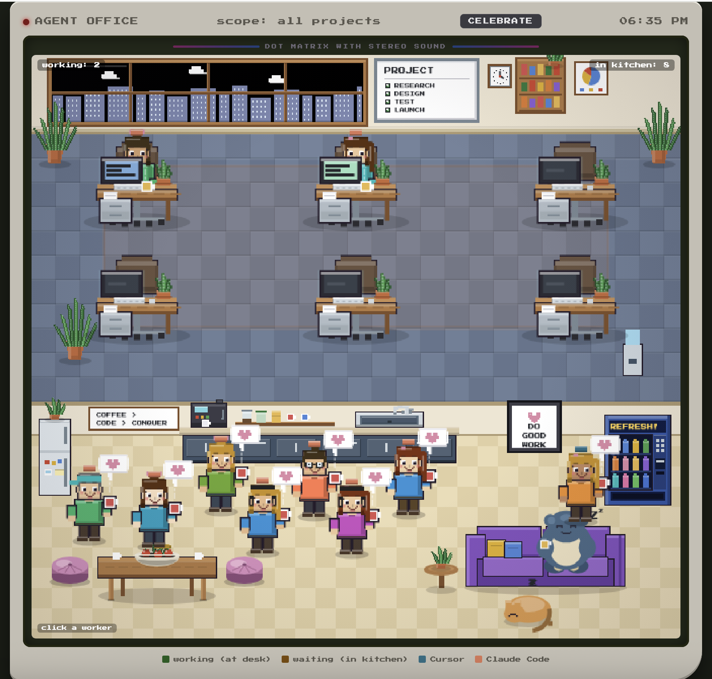

# Agent Office

A tiny Game Boy-style "office" that visualizes your local AI coding agents. Every
active chat becomes a little pixel-art worker: agents mid-task sit at a desk and type,
agents waiting on your reply hang out in the kitchen making coffee.

It reads **both** Cursor and Claude Code sessions from your machine and shows them
together — hover any worker to see which tool it belongs to (teal = Cursor,
coral = Claude Code), its live token/spend/model, its task, and your last instruction.




## Why

Honestly? Because it's fun. Watching your agents shuffle between their desks and the
kitchen is delightful in a way a list of sessions never will be.

It's also genuinely handy: when you run several agents at once it's easy to lose track
of which are still working and which are waiting on you. This gives you a glanceable
view — who's busy (at a desk), who needs you (in the kitchen), what each is working on,
and the last tool it ran — across every project on your machine.

## Run it

No dependencies beyond Python 3.8+:

```bash
python3 cursor_office.py
```

It serves on `http://127.0.0.1:8787` and opens your browser. That's it.

Prefer a launcher that always starts fresh on a fixed port:

```bash
./run.sh
```

## How it works

Both tools store one JSON-lines transcript per chat under your home directory:

- Cursor → `~/.cursor/projects/*/agent-transcripts/`
- Claude Code → `~/.claude/projects/*/`

Agent Office reads those files, decides whether each chat's latest turn is still in
progress (→ **working**, at a desk) or has ended (→ **waiting**, in the kitchen), and
draws the room. Click a worker to see its task, latest response, recent activity, and
transcript path.

**Nothing leaves your machine.** There's no telemetry and no upload; the server binds
to `127.0.0.1` (localhost) only and reads *your own* local files.

## Useful flags

```bash
python3 cursor_office.py --hours 48        # widen the activity window (default 24h)
python3 cursor_office.py --port 9000       # change the port
python3 cursor_office.py --project my-app  # only one root/project (substring match)
python3 cursor_office.py --list-projects   # list roots with active sessions, then exit
python3 cursor_office.py --no-cursor       # hide Cursor agents (Claude Code only)
python3 cursor_office.py --no-claude       # hide Claude Code agents (Cursor only)
python3 cursor_office.py --no-workflows    # hide dynamic workflow tents (Workflow tool runs)
python3 cursor_office.py --demo            # fake workers, so you can try it with no data
python3 cursor_office.py --no-open         # don't auto-open the browser
python3 cursor_office.py --watch           # dev hot-reload: restart + refresh the tab on edits
```

In `--watch` mode the server watches `cursor_office.py` and restarts itself whenever you
save an edit; the open browser tab notices (via `/api/version`) and reloads on its own, so
you see both backend and UI changes without touching the terminal or the browser.

## Notes

- "Working vs waiting" is decided by turn state, not raw file recency, so a genuinely
  busy chat stays at its desk through long tool calls. A turn that's been silent for
  over two hours is treated as abandoned and sent to the kitchen.
- When a Claude Code chat spawns a dynamic **Workflow** (the `Workflow` tool, which runs
  many subagents in phases), a small pixel-art **whiteboard easel** appears next to that
  chat's desk: the workflow name, a `done/total` progress count, and a tight crew of tiny
  helper dwarves (one per running subagent). Only genuinely-live workflows show — a run
  whose agents went silent (crashed or finished without a result) is treated as done, not
  left hanging. If several workflows share a desk they aggregate into one easel labelled
  `N runs`. Hover to see each run's name, summary, an ordered **phase stepper** (coloured
  done / in-progress / pending), and what its subagents are doing right now. (True
  per-phase counts aren't shown because the phase→subagent mapping isn't recorded on disk,
  so the stepper never fabricates a number.) A running workflow also keeps its parent chat
  at a desk. The easel closes when the workflow finishes, but a full summary always stays
  in the chat's detail panel (click the worker to open it). Hide them all with `--no-workflows`.
- If you run agents in Multitask mode, a parent whose own turn ended still counts as
  working while a background subagent is active — its desk shows a dim standby screen (it
  isn't typing itself) while the helper dwarf beside it keeps working.
- Scheduled / automated agents (cron jobs, daily monitors — anything launched by a
  scheduled task) are drawn as **couriers**: a solid uniform with a matching cap and an
  envelope badge, so a squad of recurring jobs doesn't get mistaken for chats you
  started yourself. The header **✉** button hides them (they walk off-screen) and shows
  them again (they walk back in); the choice is remembered across reloads.
- A soft chime plays when an agent finishes (working → waiting). Toggle it with the
  **♪** button in the header; the preference is remembered across reloads.
- The bottom of the room is split into a **kitchen** (agents waiting on you) and a
  **beach** (agents you're done with). Open any worker and hit **🏖 Send to beach** to
  mark that loop finished — they'll go sit on the sand in sunglasses with a cocktail
  until you **Bring back to work**. It's your call, sticky across reloads, independent
  of the agent's status.
- It's a single self-contained file — drop `cursor_office.py` anywhere and run it.

## License

MIT — see [LICENSE](LICENSE).
